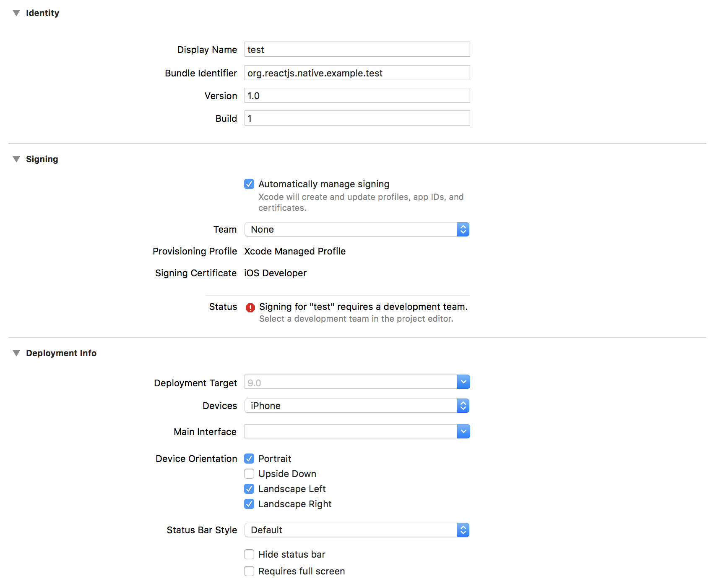

# React Native Quick Start

This is a Quick Start guide for Pure React Native, see the Expo Quick Start Guide for Expo.

## Dependencies ##

   * [Node](https://nodejs.org/en/download/)
   * [Homebrew](https://brew.sh/)
   * [Xcode](https://developer.apple.com/xcode/)
   * [Android Studio](https://developer.android.com/studio/)

## Getting Started ##
You will need to install the `react-native-cli` package using npm, run the command `npm install -g react-native-cli`. You will also need to install `watchman` using Homebrew, run the command `brew install watchman`.

You will also need Xcode and Android Studio configured. See the respective guides for setting up [Xcode]() and [Android Studio]() if you do not have them set up already.
#### Setting up the project
Once the dependencies are installed we can set up the project. To do this run the command `react-native init {project name}`, this will create a new directory with the project name inside the directory the command was ran in. You will have the following files and directories inside this directory.

##### App.js
This is a place holder component that is used as an entry point for the ReactJs App when the JavaScript bundle is loaded into the app. This is usually where routing is managed with app screens being imported as components. 

##### Index.js
This is the root file of the ReactJs App. This usually should be ingnored and App.js should be used to build the app.

##### App.json
The app configuration is stored in this file. The two fields are `name` and `displayName`. The field `name` is the short name for the app that won't appear on the device. The `displayName` is the name that will appear below the app icon on the users home screen.

##### ios
The `ios` directory contains the Xcode project. Unless you are writing native code or running your app on an actual device you will not need to touch this until you come to build the app for production.

##### android
The `android` directory contains the Android Studio project. Unless you are writing native code you will not need to touch this until you come to build the app for production.

#### Running your app
##### iOS
In order to run the app on an iOS simulator simply run the command `react-native run-ios`.

Running the app on an actual iOS device is more complicated. Navigate to the `ios` directory and follow the guide for setting up Fastlane for the project. Once you have initialised Fastlane run the command `fastlane match development`. Once you have done this open the `.xcodeproj` file. This will open the xcode project. On the left you you will a file tree, click on the root object which will be the name of the project. You should see the screen pictured below. 

Change the bundle identifier to `com.langleyfoxall.{project name}` and untick `Automatically manage signing`. You will now be given the option to select your own provisioning profile and certificates. For debug select the match development certificate and provisioning profile. You can now plug your device into the Mac and select the device in the top right and click the play button to load the app onto the device. While building the app the JavaScript bundle will be complied and bundled into the app. **There is not need to reinstall the app when changes are made to the JavaScript files. Shake the device when the app is open and enable live reloading, this will send the updates for the JavaScript OTA.** If you make any changes to native code you will have to install the app with the updated code.

##### Android
To run your app on your Android device or Emulator simply run the command `react-native run-android`.

You can also open the `android` directory in Android Studio and load the app onto the device using Android Studio.

#### Writing code
The React app can now be written in `App.js`